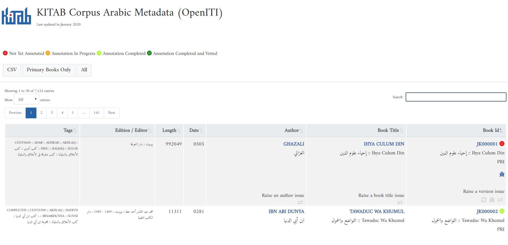
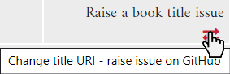

# The new OpenITI metadata search

The OpenITI corpus was designed in a way that makes it easy for scripts to access, identify and analyze the texts in the corpus. As a human reader, it was until now not easy to find a particular text you are interested in: all texts have a filename that starts with the death date of the author, followed by a short transliterated version of the author’s name and the book title (for more on OpenITI’s Unique Record Identifier (URI) system, see [https://alraqmiyyat.github.io/OpenITI/](https://alraqmiyyat.github.io/OpenITI/)).

The text files are stored in GitHub repositories (folders) that represent 25-year time spans of the hijri era. While this is very convenient for a script, if a human reader does not know the death date of an author, it may be very cumbersome to locate the file in the 60 repositories. 

We now have a new way to search for files in the OpenITI corpus: 

[https://kitab-corpus-metadata.azurewebsites.net/](https://kitab-corpus-metadata.azurewebsites.net/arabic-version.html)

You can search the metadata of the entire corpus for author and title, in Arabic and ASCII transliteration. The new metadata search also allows filtering the corpus on the annotation status of the text. 

With the  button, you can also choose to display only the primary texts, i.e., the “best” digital edition of every book in the corpus. 

If you notice that there is a problem with a text’s URI, you can notify us by clicking the link at the bottom of each Author, Title and Version cell:

You can also notify us if you notice an issue with the quality of a text (e.g., if it is incomplete).

Happy searching!
